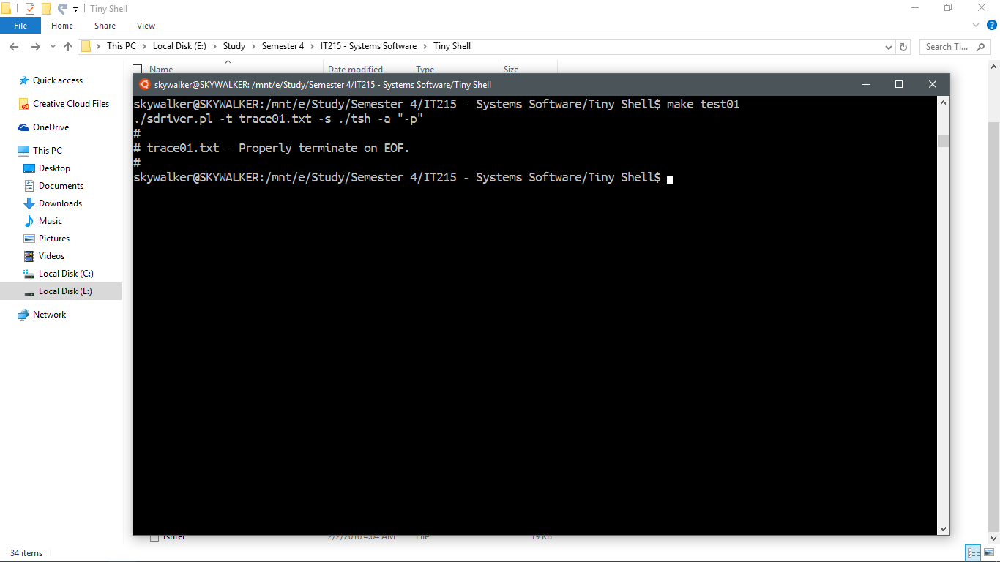

# Tiny Shell

By Akash Gajjar

## Requirements

Knowledge of c programming, linux commandline and linux processes is required to understand this piece of code.

## Brief Intro

This is a part of an assignment in my course of System Software. This is a look alike shell program and it has a limited functionality. It is an easy project if you follow getting started pdf. 

## Files

- Makefile      - Compiles your shell program and runs the tests
- README.md     - This file
- tsh.c         - The heart of this whole project
- tshref        - The reference shell binary.

## Wraping the head around

- run  `make test<testnumber>` to run tests on tsh which are specified in the trace files
- run `make rtest<testnumber>` to compare the tsh output with tshref (which is the reference shell)

## Screenshots

### The files that are used to test shell

- sdriver.pl    # The trace-driven shell driver
- trace*.txt    # The 15 trace files that control the shell driver

### Little C programs that are called by the trace files

- myspin.c  - Takes argument `n` and spins for `n` seconds
- mysplit.c - Forks a child that spins for `n` seconds
- mystop.c  - Spins for `n` seconds and sends SIGTSTP to itself
- myint.c   - Spins for `n` seconds and sends SIGINT to itself